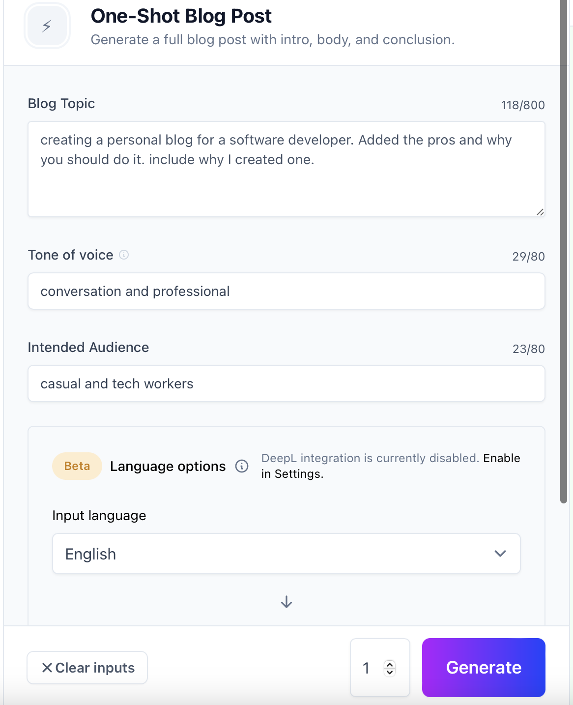

## Confession Time
It's official - my last blog post was not written by me, but rather generated by an AI! I know what you're thinking- how could someone like me, a professional wordsmith and all-around writer extraordinaire, ever allow an AI to take the reins of their blog? Well, it all started when I heard about Jasper: a state-of-the-art artificial intelligen... blah... blah... So apparently if I tell Jasper to write or confession about my last blog post, it makes me sound like a narcissist and start rambling about how great it is. 

But Jasper's confession is all true, even if I do not like how pretentious it made me sound. The only writing I did for my last post was a few parameters into Jasper's One-Shot Blog Post template. Then I had to wait a few seconds... and then BANG, I had a full 5 paragraph blog post ready for the site. While I am in the mood of making confessions... I didn't even proofread that last post before publishing, the only thing I did with the generated text was Cmd+C, Cmd+V, reformatted the headers, and clicked publish. 

## Who Is This Jasper??
To Jasper's credit, it is a solid blog post. I agree with pretty much everything it wrote. The title is a bit long and boring but doubt I could have thought of anything better. So, who is this Jasper?

prompt "tell the reader what Jasper AI is"
Jasper AI is an artificial intelligence-based content creation platform that helps writers, marketers, and publishers generate content faster and easier. It uses natural language processing (NLP), machine learning (ML) algorithms, and a robust database of creative ideas to generate unique and meaningful content for any purpose. 

Well, there you have it straight from Jasper's mouth... or should I call it Jasper’s natural language processing orifice... I also tried to get Jasper to tell me the company's startup history, but it had issues giving me the correct info. <small>\**Can an AI have an identity crisis?*\*</small> So I had to Google this and type it myself. <small>\**my poor fingers*\*</small> Jasper AI was cofounded in Austin, TX by  Dave Rogenmoser, JP Morgan *not the bank* and Chris Hull. Currently, they have 180 employees and in October 2022 they raised $125 million Series A funding round at a $1.5 billion valuation. Click [here](https://www.ycombinator.com/companies/jasper-aihttps://www.ycombinator.com/companies/jasper-ai) to read Jasper's full Ycombinator bio. 

## Jasper the Jester
So, you may have noticed in the last section I had to Google Jasper's history myself. <small>\**[my fingers still hurt](https://youtu.be/SrIf0oYTtaI)*\*</small> So Jasper is not good at everything. Jasper has its limits on current events, the GPT-3 model was only trained on data from 2021 an earlier. So good luck using it for current events, but it can happen with anything. Jasper will write all sorts of incorrect information, from simple facts to software coding, so you need to be careful and not believe everything our AI overlord says...

The fun thing is Jasper, and all other ML algos, are confidently incorrect. Ask it to write something and it will give you a confident but completely wrong answer. So you will need to still proofread everything thing and verify that the information generated is correct.

## Jasp-er Up Your Writing Speed Now! 
<small>\**I couldn’t think of any clever so Jasper generated this title...*\*</small>     A few things I have found Jasper is great at are rewording and writing in whatever tone of voice you set. I am not the best writer on my own and sometimes I get stuck on what I should talk about next. Jasper is great at creating ideas and topics for blog posts. Jasper also has a lot of other templates for copyrighting, everything from Amazon product descriptions to TikTok captions. Another big feature I barely used is search engine optimization (SEO) is built into most templates and functions. So Jasper is great at generating text with all the keywords included and still being readable.

## Bye For Now
So my first month playing with Jasper has been really fun. I have had a lot of emotions using it, from amazement, when Jasper writes something that sounds completely human, to cracking up laughing at how ridiculously wrong it can be. I am not sure if I would be bothered to restart this blog without the assistance of Jasper. I also have only scratched the surface of the capabilities Jasper has to offer, so I hope I can find more tools in Jasper to become a better and faster writer. I will be sure to give a few updates on what I end up useing Jasper for in the future. Stay Tuned!



If you want to try Jasper for yourself click [here](https://jasper.ai?utm_source=partner&fpr=alan51) to use my affiliate code to receive 10,000 free words.